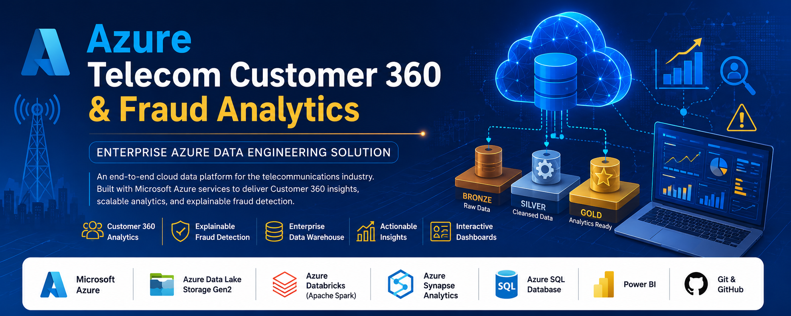
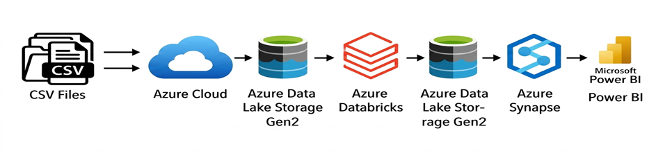
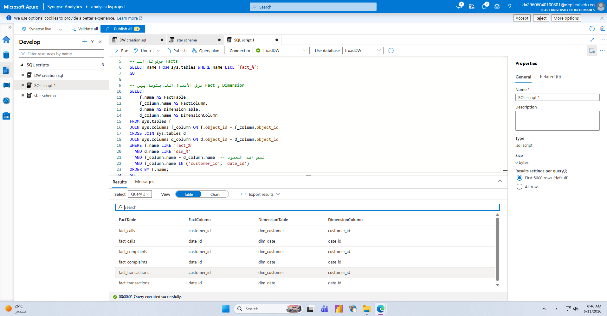
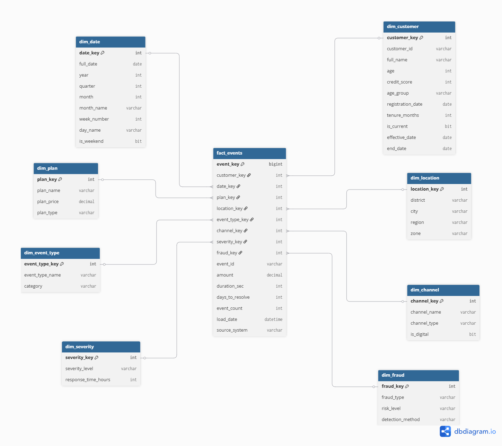
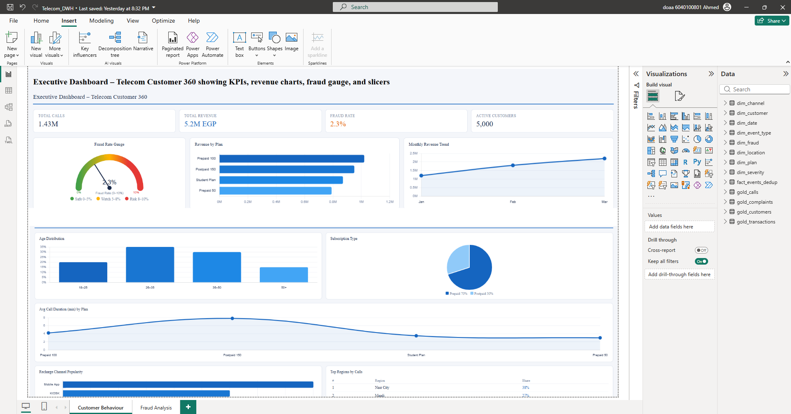
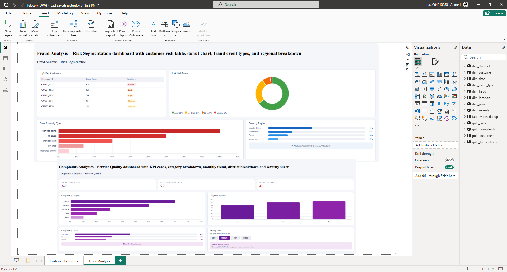
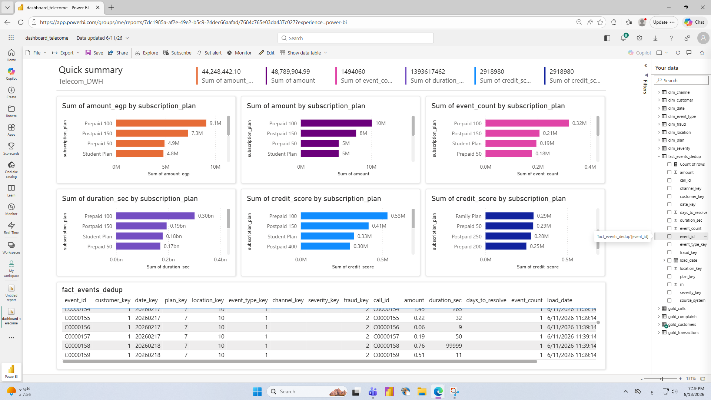

# ☁️ Azure Telecom Customer 360 & Fraud Analytics

## Enterprise Azure Data Engineering Solution

<p align="center">
  
</p>

<p align="center">


</p>

An enterprise-scale Azure Data Engineering solution that centralizes telecom operational data into a modern cloud data warehouse. The platform leverages **Azure Data Lake Storage Gen2**, **Azure Databricks**, **Azure Synapse Analytics**, **PySpark**, and **Power BI** to deliver **Customer 360 analytics**, **explainable fraud detection**, and interactive business intelligence dashboards using the **Medallion Architecture (Bronze–Silver–Gold)**.

---

# 📖 Table of Contents

- [Project Overview](#-project-overview)
- [Business Objectives](#-business-objectives)
- [Solution Architecture](#-solution-architecture)
- [Azure Environment](#-azure-environment)
- [Data Pipeline](#-end-to-end-data-pipeline)
- [Technology Stack](#-technology-stack)
- [Medallion Architecture](#-medallion-architecture)
- [Data Warehouse Design](#-data-warehouse-design)
- [Fraud Scoring Engine](#-explainable-fraud-scoring-engine)
- [Power BI Dashboards](#-power-bi-reporting)
- [Project Statistics](#-project-statistics)
- [Business Value](#-business-value)
- [Future Enhancements](#-future-enhancements)
- [Author](#-author)

---

# 📌 Project Overview

Telecommunication companies generate millions of operational events every day, including call records, customer activities, subscriptions, financial transactions, and service complaints. Extracting valuable insights from these large datasets requires a scalable and well-governed cloud data platform.

This project demonstrates the implementation of an enterprise-grade Azure Data Engineering solution that:

- Centralizes telecom operational data into a modern cloud data warehouse.
- Provides a unified Customer 360 analytical view.
- Applies automated data quality validation.
- Detects suspicious customer behavior using explainable fraud rules.
- Delivers interactive business intelligence dashboards through Power BI.

The entire solution follows Microsoft's **Medallion Architecture**, ensuring high-quality, scalable, and analytics-ready datasets.

---

# 🎯 Business Objectives

- Design a scalable cloud-native telecom data warehouse.
- Build a unified Customer 360 analytical platform.
- Improve data quality through automated validation rules.
- Detect suspicious customer behavior using a transparent fraud scoring model.
- Deliver interactive dashboards for business users and executives.
- Enable trusted, data-driven decision making.

---

# 🏗 Solution Architecture

The platform follows a modern Azure Data Engineering architecture, where data flows through multiple processing layers before reaching the analytical warehouse and reporting layer.

<p align="center">
  
</p>

### Architecture Components

- Azure Data Lake Storage Gen2
- Azure Databricks
- Bronze Layer
- Silver Layer
- Gold Layer
- Azure Synapse Analytics
- Power BI

---

# ☁ Azure Environment

The project was developed entirely on Microsoft Azure using Azure Databricks as the primary data engineering and processing environment.

## Azure Databricks Workspace

<p align="center">

</p>

Azure Databricks was used to:

- Process large-scale telecom datasets.
- Develop ETL pipelines using PySpark.
- Perform distributed data transformations.
- Execute data quality validation.
- Generate analytical Gold datasets.

---

## Workspace Deployment

<p align="center">

</p>

The workspace was configured to integrate seamlessly with Azure Data Lake Storage Gen2, enabling scalable cloud-based data processing.

---

# 🔄 End-to-End Data Pipeline

The platform follows a structured ETL pipeline based on the Medallion Architecture.

<p align="center">

</p>

### Pipeline Workflow

1. Ingest raw telecom datasets from CSV files.
2. Store raw data in Azure Data Lake Storage Gen2 (Bronze Layer).
3. Clean, standardize, and validate data using Azure Databricks.
4. Publish curated datasets to the Silver Layer.
5. Generate business-ready Gold datasets.
6. Build the analytical warehouse using a Star Schema.
7. Connect Power BI to deliver interactive dashboards.

---

# ⚙ Technology Stack

| Category | Technology |
|----------|------------|
| Cloud Platform | Microsoft Azure |
| Data Lake | Azure Data Lake Storage Gen2 |
| Data Processing | Azure Databricks (Apache Spark & PySpark) |
| Data Warehouse | Azure Synapse Analytics |
| Database | Azure SQL Database |
| Data Modeling | Star Schema |
| Programming | Python |
| Query Language | SQL |
| Data Visualization | Power BI |
| Version Control | Git & GitHub |

---

# ⭐ Solution Highlights

- Enterprise Azure Data Engineering Architecture
- Medallion Data Lake Design
- Customer 360 Analytics
- Explainable Fraud Scoring Engine
- Star Schema Data Warehouse
- Automated ETL Pipeline
- Data Quality Validation Framework
- Executive Power BI Dashboards

---
# 🥉 Medallion Architecture

The project follows the **Medallion Architecture** to progressively improve data quality while separating raw, cleansed, and business-ready datasets.

---

## Bronze Layer

The Bronze layer stores raw telecom datasets exactly as received from the source systems.

Data Sources include:

- Customer Profiles
- Call Detail Records (CDRs)
- Transactions
- Complaints

This layer acts as the single source of truth and preserves historical raw data without modifications.

---

## Silver Layer

The Silver layer applies data cleansing, standardization, and validation using **Azure Databricks (PySpark)**.

Key transformations include:

- Missing value handling
- Duplicate removal
- Data type validation
- Business rule validation
- Data normalization
- Null value treatment
- Invalid record filtering
- Standardized column naming

### Data Quality Framework

The project implements **13 automated Data Quality Rules** to ensure trusted analytical datasets before loading the Gold layer.

---

## Gold Layer

The Gold layer contains business-ready datasets optimized for reporting, analytics, and executive dashboards.

### Customer Gold Dataset

<p align="center">

</p>

---

### Plan Gold Dataset

<p align="center">

</p>

---

### Call Gold Tables

<p align="center">

</p>

The Gold layer provides optimized datasets for:

- Customer 360 Analytics
- Fraud Detection
- Executive Reporting
- Power BI Dashboards

---

# ⭐ Data Warehouse Design

A dimensional data warehouse was designed using a **Star Schema** to simplify analytical queries and improve reporting performance.

<p align="center">

</p>

---

## Data Warehouse Structure

### Fact Table

- Fact_CustomerActivity

### Dimension Tables

- DimCustomer
- DimDate
- DimRegion
- DimPlan
- DimFraudRisk
- DimComplaint
- DimCallType
- DimUsageCategory

---

## Warehouse Summary

| Object | Count |
|----------|------:|
| Fact Tables | 1 |
| Dimension Tables | 8 |
| Gold Tables | 3 |

---

# 🚨 Explainable Fraud Scoring Engine

The project includes an explainable **Rule-Based Fraud Scoring Engine** that identifies suspicious customer behavior using transparent business rules.

Unlike black-box machine learning models, every fraud score can be fully interpreted and traced back to specific customer activities.

---

## Fraud Indicators

### High-Risk Indicators

- Excessive outgoing calls
- High number of unique recipients
- Unusually short call durations
- High calling frequency
- Repeated customer complaints
- Suspicious behavioral patterns

### Trust Indicators

- Long customer tenure
- Stable payment history
- Consistent service usage
- Normal calling behavior

---

## Risk Classification

| Fraud Score | Risk Level |
|-------------|------------|
| 0 – 29 | 🟢 Low |
| 30 – 59 | 🟡 Medium |
| 60 – 79 | 🟠 High |
| 80 – 100 | 🔴 Critical |

---

# 📊 Power BI Reporting

Business insights are delivered through interactive Power BI dashboards connected to the analytical warehouse.

The reporting layer enables executives and business analysts to monitor operational performance and customer behavior in real time.

---

## Power BI Data Model

<p align="center">

</p>

The semantic model follows the Star Schema to improve performance, simplify DAX calculations, and support scalable reporting.

---

# 📈 Executive Dashboard

<p align="center">

</p>

### Key Insights

- Executive KPIs
- Customer Growth
- Revenue Overview
- Fraud Distribution
- Business Performance
- Monthly Trends

---

# 🚨 Fraud Analytics Dashboard

<p align="center">

</p>

### Key Insights

- Fraud Score Distribution
- Customer Risk Segmentation
- High-Risk Customers
- Fraud Trends
- Risk Monitoring

---

# 👥 Customer Behavior Dashboard

<p align="center">

</p>

### Key Insights

- Customer Segmentation
- Usage Trends
- Calling Patterns
- Customer Activity
- Customer 360 Analytics

---
# 📈 Project Statistics

The project was developed to simulate a real-world enterprise telecom analytics platform capable of processing large-scale customer and operational datasets.

| Metric | Value |
|----------|------:|
| Customers | **5,000+** |
| Call Detail Records | **1.4 Million+** |
| Analysis Period | **3 Months** |
| Data Quality Score | **98.8%** |
| Data Quality Rules | **13** |
| Gold Tables | **3** |
| Fact Tables | **1** |
| Dimension Tables | **8** |
| Pipeline Runtime | **~15 Minutes** |

---

# 💼 Business Value

This solution demonstrates how modern Azure Data Engineering can transform raw telecom data into trusted analytical assets that support business intelligence and operational decision-making.

### Key Business Outcomes

- Delivered a centralized **Customer 360** analytical platform.
- Improved data quality using automated validation rules.
- Enabled explainable fraud detection through business-driven scoring logic.
- Simplified analytical reporting using a dimensional data warehouse.
- Reduced data preparation effort through automated ETL pipelines.
- Delivered executive dashboards for monitoring key business metrics.
- Established a scalable cloud-native analytics architecture.

---

# 🏆 Key Achievements

- Designed and implemented an end-to-end Azure Data Engineering solution.
- Built a scalable cloud data warehouse using Medallion Architecture.
- Processed over **1.4 million telecom records**.
- Developed automated ETL pipelines using Azure Databricks and PySpark.
- Applied **13 Data Quality Rules** to ensure trusted analytical data.
- Designed an optimized **Star Schema** for reporting and analytics.
- Implemented an explainable Rule-Based Fraud Scoring Engine.
- Delivered interactive Power BI dashboards for executive reporting and operational analytics.

---

# 🛠 Skills Demonstrated

This project demonstrates hands-on experience with:

### Cloud & Data Engineering

- Microsoft Azure
- Azure Data Lake Storage Gen2
- Azure Databricks
- Azure Synapse Analytics

### Data Processing

- Apache Spark
- PySpark
- ETL / ELT Pipelines
- Data Cleansing
- Data Transformation
- Data Quality Validation

### Data Warehousing

- Star Schema
- Dimensional Modeling
- Fact & Dimension Design
- Customer 360 Analytics

### Analytics & Visualization

- Power BI
- Dashboard Development
- Business Intelligence
- KPI Reporting
- Fraud Analytics

### Programming

- Python
- SQL
- Git
- GitHub

---

# 🚀 Future Enhancements

The platform can be further enhanced by integrating advanced Azure services and machine learning capabilities.

Planned improvements include:

- Machine Learning-based Fraud Prediction
- Azure Machine Learning Integration
- Real-Time Streaming with Azure Event Hub
- Azure Data Factory Orchestration
- Customer Churn Prediction
- Advanced Anomaly Detection
- Incremental Data Loading
- Delta Lake Optimization
- Unity Catalog Integration
- CI/CD with GitHub Actions
- Microsoft Fabric Migration

---

# 📂 Repository Structure

```text
Telecom-Customer360-Fraud-Analytics
│
├── Bronze/
├── Silver/
├── Gold/
├── screenshots/
│   ├── Azure Databricks_workspace.png
│   ├── Create Workspace DBricks.png
│   ├── joining.png
│   ├── customer_gold to schema.png
│   ├── plan_gold to schema.png
│   ├── call_golds tables.png
│   ├── star_schema.png
│   ├── add table to power pi.png
│   ├── executive_dashboard.png
│   ├── fraud_dashboard.png
│   └── customer_dashboard.png
│
└── README.md
```

---

# 👩‍💻 Author

## Esraa Abdelazeem

**Azure Data Engineer | Data Engineer | Python | SQL | PySpark | Azure Databricks | Azure Synapse Analytics | Power BI**

Passionate about designing scalable cloud data platforms, building modern data warehouses, and transforming raw data into meaningful business insights through Azure Data Engineering solutions.

### Contact

📧 **Email**  
esraaabdelazeem79@gmail.com

💼 **LinkedIn**  
https://www.linkedin.com/in/esraa-abdelazeem/ar

🐙 **GitHub**  
https://github.com/esraaa-png

---

## License

This project is intended for educational and portfolio purposes.

---

## If you found this project useful, consider giving it a ⭐ on GitHub.
